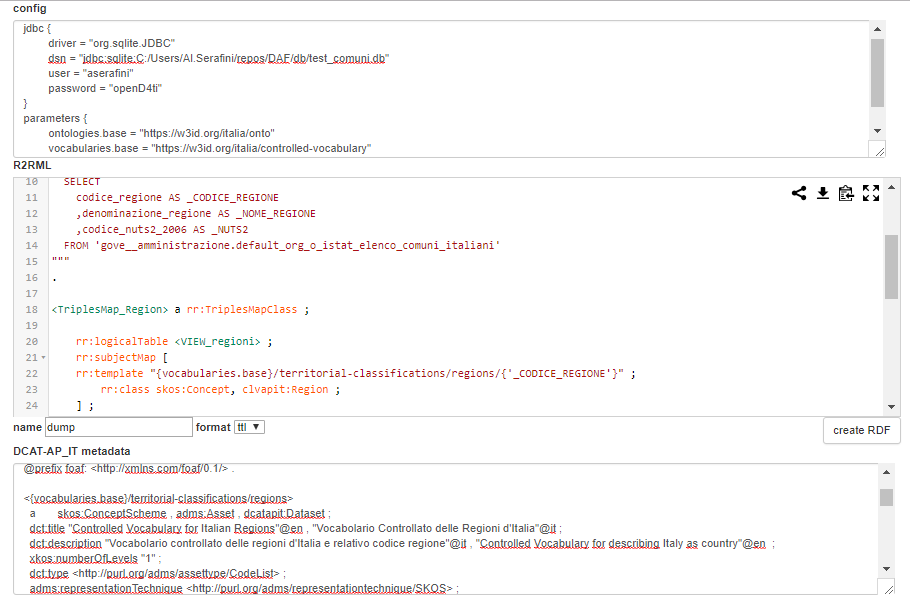

RDF triplifier
=========================

[README last update: 2018-07-11] *pre-alpha* version

This component provides a simple microservice for creating an RDF representation of data from a JDBC connector.

The RDF processor used is [Ontop](https://ontop.inf.unibz.it/), which implements the W3C standard [`R2RML`](https://www.w3.org/TR/r2rml/) language for *tabular to RDF conversion*.

**NOTE** (Impala)

the `ssl_impala` folder should be created under the root folder of the project, and should contain the following files:

```bash
├───ssl_impala
│       jssecacerts
│       master-impala.jks
│       master-impala.pem
```


* * *

## stateless endpoint

A simple (stateless) version of endpoint for executing the R2RML mapping process can be used as follow:


```bash
curl -X POST 'http://localhost:7777/kb/api/v1/triplify/process' \
	-H "accept: text/plain" \
	-H "content-type: application/x-www-form-urlencoded" \
	--data-binary "config=${config}" \
	--data-binary "r2rml=${r2rml}" \
	-d 'format=text/turtle'
```

**NOTE** that this version of the service expects the actual content of the mapping, so when using curl it's best to prepare it
using a shell variable such as ```r2rml=`cat r2rml_file` ``` before launching curl.

The directory `/script` contains some example, which can be extended.


otherwise we can test the endpoint by using the example page `http://localhost:7777/static/r2rml.html`:



----

## dataset-oriented endpoint

Another endpoint is provided, which may be useful for calling the process by different datasets, for example from a workflow/pipeline orchestrator.
This could be useful when we need to divide a mapping process, creating some different dataset (for example a dataset for each resource type).

The structure of a call is the following:
```
/kb/api/v1/triplify/datasets/{group}/{dataset_path}.{ext}?cached={T|F}
```

where the idea is to expose the last created RDF representation for a dataset, unless an explicit `cached=false` parameter is provided.
This way the first time the endpoint is called it will generate the dump, the other one we can choose to re-use data already created.
The `group` parameter is simply a useful way to divide data for testing from the other, while the `dataset_path` can be used to create subdivisions.
The mappings needs to be prepared on disk accordingly, as explained later.

### example: creating the RDF for the `regions` example
```
curl -X GET 
	http://localhost:7777/kb/api/v1/triplify/datasets/test/territorial-classifications/regions.ttl?cached=true 
	-H  "accept: text/plain" 
	-H  "content-type: application/x-www-form-urlencoded"
```

each configuration on disk will have a structure similar to the one used for testing on SQLite example database:

```bash
├───/data
│   └───test
│       └───territorial-classifications
│           ├───cities
│           │   └─── ...
│           ├───provinces
│           │   └─── ...
│           └───regions
│           	├───regions.conf
│               ├───regions.metadata.ttl
│               └───regions.r2rml.ttl
...
```

TODO: 
	+ add config example
	+ add R2RML example
	+ add metadata example/ explaination 

* * *

**SEE ALSO**: [daf-semantics](https://github.com/italia/daf-semantics) project


* * *

## running locally


```bash

mvn clean package

java -cp "target/target/triplifier-0.0.4.jar;target/libs/*" triplifier.main.MainHTTPTriplifier

```


* * *


## TODO

+ update `DockerFile`
+ merge of external manual swagger definitions
+ fix swagger problems with multi-lines: try updating to version 3+
+ add an internal interlinking strategy, using silk/duke

Ideally we could imagine having some specific microservices:
+ one for handling merging of RDF, and direct publication
+ one for creating relations between the current datasource and an external target, using silk or duke


