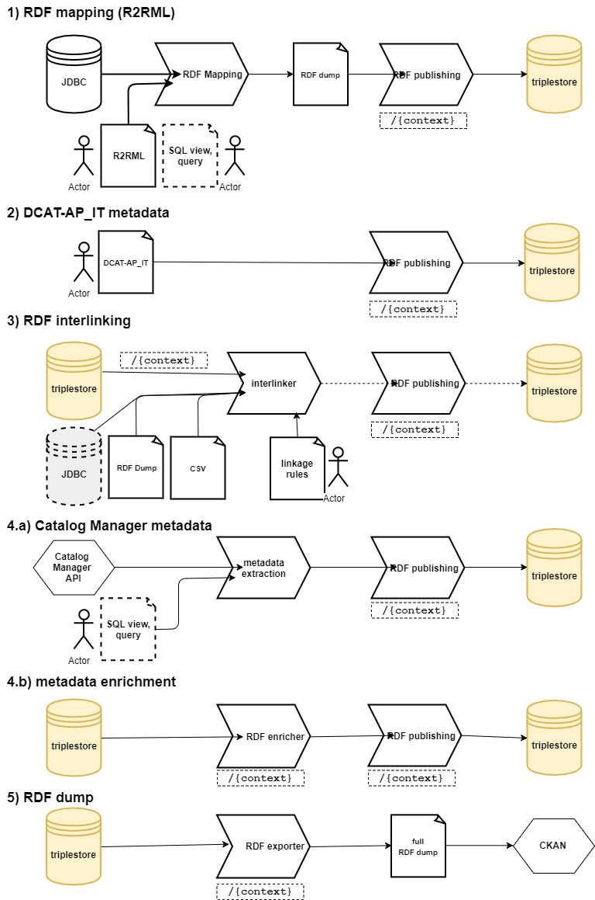

[draft]

This document (still work in progress) aims to give a simple idea of various possible RDF production, enrichment, interlinking.
The idea is that a full workflow of semi-automatic (supervised) RDF production should contain all these "circuits" and integrate them with a graphic dataflow designer, such as the ones provided by NiFi, Pentaho and so on.

1. Is the typical RDF creation workflow, using the standard W3C mapping language (R2RML). Our microservice extends the parameters support.
I't also possibile to prepare the DCAT-AP_IT metadata file and add it directly, avoiding the "circuit" `2.`.

2. Currently the DCAT-AP_IT metadata are prepared manually, and then added to the dataset. In future releases this part should be produced by a dedicated editing endpoint / UI.
	+ DAF example case study: IPA dataset
	for IPA dataset we explored some different way to produce the internal references for cities and territorial entities in general. Reconstructing those internal implicit references is conceptually similar to a common interlinking phase, as we have to create new relations between things using their textual informations.
The first POC actually uses a slightly complex SQL JOIN, future development should adopt more robust and flexible solutions such as silk, duke, or improve the data preparation during the ETL phase.

3. interlinking is usually a process between existing RDF resources, either on SPARQL endpoint or RDF file. In order for this to work, the microservice should typically handle the configuration somebody has already prepared manually, then execute it with the linkage engine (silk, duke).
In order to avoid writing an ad-hoc microservice, wrapping the linkage enine, the best it's to install a dedicated service such as [silk framework] (http://silkframework.org/)
Future releases should explore the idea of adding new datasources to silk, for example introducing a customizable JDBC datasource.

4. enrichment: we can imagine having a microservice handling metadata, and another one which is able to produce enriched metadata, using both the basic one and the RDF produced in the standard way by the R2RML mapping.

5. RDF dump: it's possible to porduce a full dataset, with enrichments, using standard SPARQL `CONSTRUCT` statements over an existing standard context.
A standard workflow may publish the created full RDF dump on CKAN or similar DMS.
